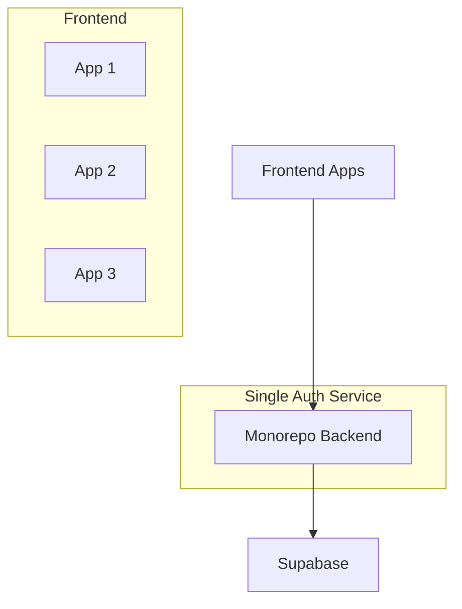

# Centralized Supabase Authentication Guide

## Recommended Architecture

### Single Backend Approach (Recommended)


Benefits:
- Single source of truth for auth configuration
- One set of URL redirects to manage
- Consistent auth behavior across apps
- Centralized error handling and logging
- Easier to maintain and update

## Implementation

### 1. Backend Configuration
```python:backend/app/config.py
# Single configuration for all apps
ALLOWED_REDIRECT_URLS = [
    "http://localhost:5177",  # Local development
    "https://*.dhg-hub.org",  # All production apps
    "https://*.vercel.app"    # All preview deployments
]
```

### 2. Frontend Configuration
```typescript:apps/shared/config/auth.ts
// Shared auth configuration
export const AUTH_CONFIG = {
  apiUrl: process.env.API_URL || 'http://localhost:8000',
  endpoints: {
    login: '/api/auth/login',
    signup: '/api/auth/signup',
    reset: '/api/auth/reset-password'
  }
}
```

### 3. Auth Service Pattern
```typescript:apps/shared/services/auth.ts
// Shared auth service for all apps
export class AuthService {
  private static instance: AuthService;
  private baseUrl: string;

  private constructor() {
    this.baseUrl = AUTH_CONFIG.apiUrl;
  }

  public static getInstance(): AuthService {
    if (!AuthService.instance) {
      AuthService.instance = new AuthService();
    }
    return AuthService.instance;
  }

  // Shared auth methods
  async login(credentials: LoginCredentials) {
    return fetch(`${this.baseUrl}/api/auth/login`, {
      method: 'POST',
      credentials: 'include',
      body: JSON.stringify(credentials)
    });
  }
}
```

## Migration Steps

1. **Centralize Backend Auth**:
```bash
# Update backend auth service
git checkout -b feature/centralize-auth
cd backend
# Update auth.py with unified configuration
```

2. **Update Frontend Apps**:
```bash
# Create shared auth package
cd packages
mkdir shared-auth
# Add shared auth configuration and service
```

3. **Update Environment Variables**:
```env
# .env for all frontend apps
VITE_API_URL=http://localhost:8000
# Remove direct Supabase URLs
```

## Benefits

1. **Simplified Management**
- One set of Supabase credentials
- Single point for URL redirect configuration
- Unified error handling

2. **Better Security**
- Controlled access to Supabase
- Consistent security policies
- Centralized audit logging

3. **Easier Maintenance**
- Single codebase for auth logic
- Simplified testing
- Consistent behavior

4. **Scalability**
- Easy to add new frontend apps
- Consistent auth experience
- Shared session management

## Best Practices

1. **Configuration**
```typescript
// Use environment-based configuration
const config = {
  development: {
    apiUrl: 'http://localhost:8000'
  },
  production: {
    apiUrl: 'https://api.dhg-hub.org'
  }
}
```

2. **Error Handling**
```typescript
// Centralized error handling
export const handleAuthError = (error: any) => {
  // Common error handling logic
  console.error('Auth Error:', error);
  return {
    error: true,
    message: error.message || 'Authentication failed'
  };
};
```

3. **Session Management**
```typescript
// Shared session handling
export const getSession = () => {
  return fetch(`${AUTH_CONFIG.apiUrl}/api/auth/session`, {
    credentials: 'include'
  });
};
```

## Migration Checklist

- [ ] Update backend auth service
- [ ] Create shared auth package
- [ ] Update frontend apps to use shared auth
- [ ] Test auth flow in all environments
- [ ] Update deployment configurations
- [ ] Update documentation 