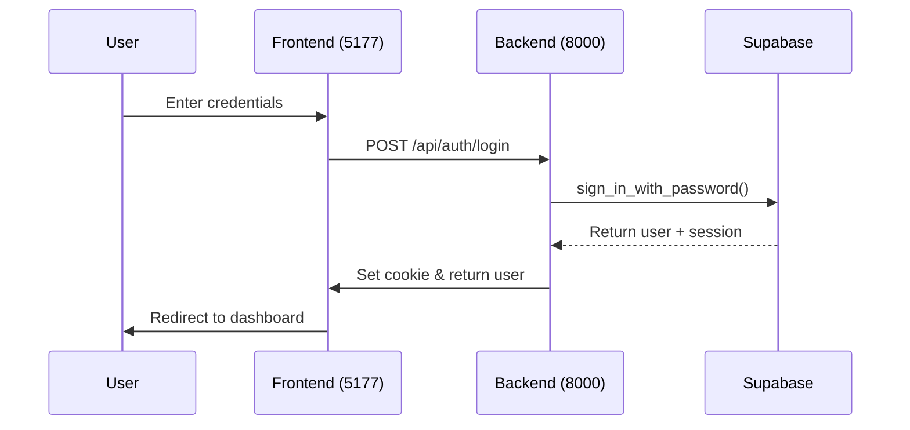
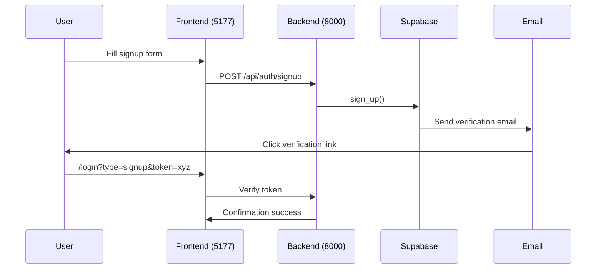
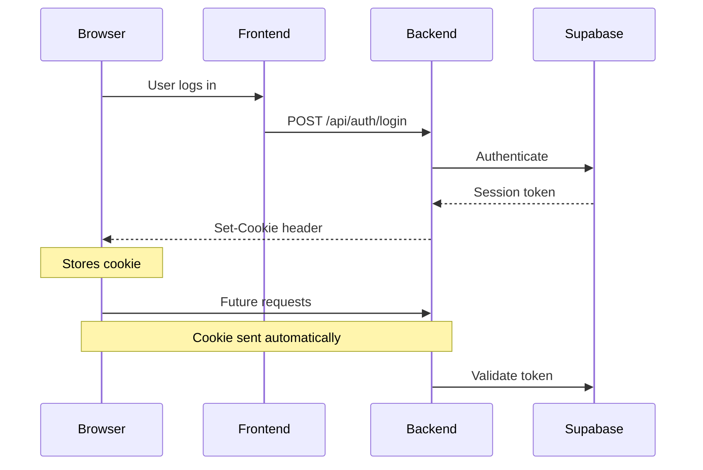

# Authentication Flow Documentation

## Overview
This document describes the authentication flows implemented in the DHG Hub application, including signup, login, password reset, and invite flows.

## Flow Diagrams

### Basic Login Flow


### Signup Flow


## API Endpoints

### Authentication Endpoints
| Endpoint | Method | Description | Request Body | Response |
|----------|--------|-------------|--------------|-----------|
| `/api/auth/login` | POST | User login | `{ email, password }` | User data + session |
| `/api/auth/signup` | POST | New user registration | `{ email, password, password_confirmation }` | Success message |
| `/api/auth/signout` | POST | User logout | None | Success message |

### Password Management
| Endpoint | Method | Description |
|----------|--------|-------------|
| `/api/auth/reset-password` | POST | Request password reset |
| `/api/auth/set-password` | POST | Set new password |

## Frontend Routes

### Login Page States
The login page (`/login`) handles different states based on URL parameters:

- `type=invite`: First-time password setup for invited users
- `type=recovery`: Password reset form
- `type=signup`: Email verification success

### Protected Routes
- `/dashboard`: Requires authenticated session

## Session Management

### Understanding Cookies

#### What are Cookies?
Cookies are small pieces of data stored in the browser that help maintain state between requests. In our auth system:

```typescript
// Cookie set by backend after successful login
response.set_cookie(
    key="sb-access-token",      // Cookie name
    value=session["access_token"], // JWT token
    httponly=True,              // Not accessible via JavaScript
    secure=True,                // Only sent over HTTPS
    samesite="lax"             // CSRF protection
)
```

#### Cookie Properties Explained
| Property | Value | Purpose |
|----------|--------|----------|
| `httponly` | `True` | Prevents XSS attacks by blocking JavaScript access |
| `secure` | `True` | Ensures cookie only sent over HTTPS |
| `samesite` | `"lax"` | Protects against CSRF while allowing normal navigation |

#### Cookie Flow


#### Cookie Security
1. **HttpOnly**: Prevents JavaScript access
   ```typescript
   // ❌ Not possible due to httpOnly
   document.cookie = "sb-access-token=123"
   ```

2. **Secure Flag**: HTTPS only
   ```typescript
   // Local development exception
   const isSecure = process.env.NODE_ENV === 'production'
   ```

3. **SameSite**: CSRF Protection
   ```typescript
   // Allows navigation but blocks cross-origin requests
   samesite="lax"
   ```

#### Development vs Production
```typescript
// Cookie options by environment
const cookieOptions = {
  development: {
    secure: false,    // Allow HTTP
    domain: 'localhost'
  },
  production: {
    secure: true,     // Require HTTPS
    domain: '.dhg-hub.org'
  }
}
```

### Cookie Structure
```typescript
response.set_cookie(
    key="sb-access-token",
    value=session["access_token"],
    httponly=True,
    secure=True,
    samesite="lax"
)
```

### Session Validation
1. Frontend checks auth context
2. Backend validates token on protected routes
3. Supabase maintains session state

## Error Handling

### Common Error Scenarios
1. Invalid credentials
2. Expired tokens
3. Unverified email
4. Missing session data

### Error Responses
```typescript
// 401 Unauthorized
{
    "detail": "Authentication failed. Please check your credentials."
}

// 400 Bad Request
{
    "detail": "Email already registered"
}
```

## Testing Auth Flows

### Test User Creation
```bash
# Create test user
curl -X POST http://localhost:8000/api/auth/signup \
-H "Content-Type: application/json" \
-d '{
  "email": "test@example.com",
  "password": "test1234",
  "password_confirmation": "test1234"
}'
```

### Test Login
```bash
curl -X POST http://localhost:8000/api/auth/login \
-H "Content-Type: application/json" \
-d '{
  "email": "test@example.com",
  "password": "test1234"
}'
```

## Security Considerations

### Password Handling
- Passwords are never stored in plain text
- All password operations use secure Supabase auth
- Password reset tokens are single-use and time-limited

### CORS Configuration
```python
app.add_middleware(
    CORSMiddleware,
    allow_origins=["http://localhost:5177"],
    allow_credentials=True,
    allow_methods=["*"],
    allow_headers=["*"],
    expose_headers=["*"]
)
```

## Debugging

### Common Debug Points
1. Session token validation
2. CORS issues
3. Cookie handling
4. Auth state management

### Debug Endpoints
```python
GET /api/auth/debug/users
GET /api/auth/debug/invite-token/{email}
POST /api/auth/debug/admin-reset-password/{user_id}
``` 