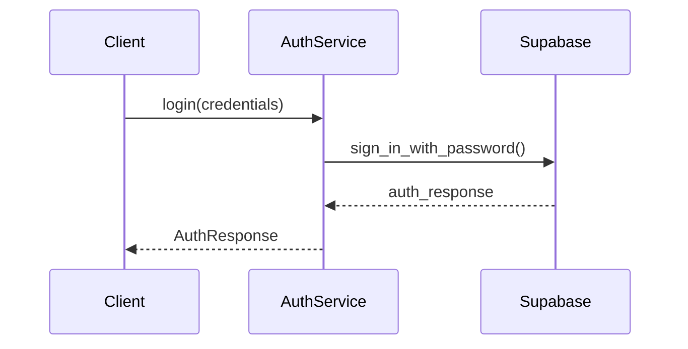
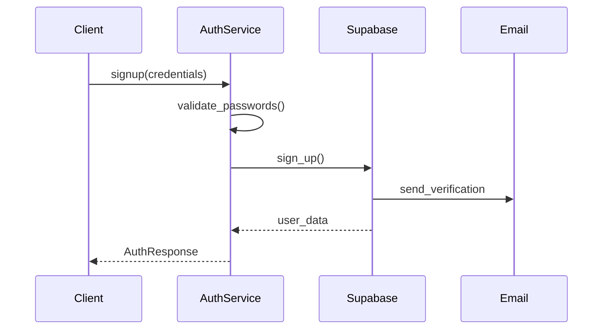

# AuthService Documentation

## Overview
The AuthService class handles all authentication operations in the backend, interfacing with Supabase for user management and authentication.

## Methods

### Login
```typescript
@staticmethod
async def login(credentials: LoginCredentials) -> AuthResponse
```

Authenticates a user with email and password.

#### Parameters
| Parameter | Type | Description |
|-----------|------|-------------|
| credentials | `LoginCredentials` | Contains email and password |

#### Returns
```typescript
AuthResponse {
    user: dict,        // User information
    session: dict,     // Session data including access token
    message: string    // Success message
}
```

#### Flow


### Signup
```typescript
@staticmethod
async def signup(credentials: SignupCredentials) -> AuthResponse
```

Registers a new user.

#### Parameters
| Parameter | Type | Description |
|-----------|------|-------------|
| credentials | `SignupCredentials` | Email, password, and confirmation |

#### Validation
- Passwords must match
- Email must be unique
- Password meets strength requirements

#### Flow


### Password Management

#### Set Password
```typescript
@staticmethod
async def set_password(request: SetPasswordRequest) -> dict
```

Sets or updates a user's password.

#### Request Password Reset
```typescript
@staticmethod
async def request_reset_password(request: ResetPasswordRequest) -> dict
```

Initiates password reset flow.

### Session Management

#### Get Current User
```typescript
@staticmethod
async def get_current_user() -> Optional[dict]
```

Retrieves currently authenticated user.

#### Signout
```typescript
@staticmethod
async def signout() -> dict
```

Ends user session.

### Email Verification

#### Verify Email
```typescript
@staticmethod
async def verify_email(token: str) -> dict
```

Verifies user's email address.

### OAuth & Callbacks

#### Handle Auth Callback
```typescript
@staticmethod
async def handle_auth_callback(params: dict) -> dict
```

Processes OAuth and email verification callbacks.

## Data Models

### LoginCredentials
```typescript
class LoginCredentials(BaseModel):
    email: EmailStr
    password: str
```

### SignupCredentials
```typescript
class SignupCredentials(BaseModel):
    email: EmailStr
    password: str
    password_confirmation: str
```

### AuthResponse
```typescript
class AuthResponse(BaseModel):
    user: dict
    session: Optional[dict] = None
    message: str
```

## Error Handling

### Common Errors
| Error | HTTP Status | Description |
|-------|-------------|-------------|
| Invalid Credentials | 401 | Wrong email/password |
| User Exists | 400 | Email already registered |
| Invalid Token | 400 | Token expired/invalid |
| No Session | 401 | User not authenticated |

### Error Response Format
```typescript
{
    "detail": string,  // Error message
    "status": number   // HTTP status code
}
```

## Security Considerations

### Password Handling
- Never log passwords
- Validate before sending to Supabase
- Use service role key for admin operations

### Session Security
```python
# Session token handling
session_dict = {
    "access_token": auth_response.session.access_token,
    "refresh_token": auth_response.session.refresh_token,
    "expires_at": auth_response.session.expires_at,
}
```

## Testing

### Unit Tests
```python
async def test_login():
    credentials = LoginCredentials(
        email="test@example.com",
        password="test123"
    )
    response = await AuthService.login(credentials)
    assert response.user is not None
```

### Integration Tests
```python
async def test_signup_login_flow():
    # 1. Signup
    signup_creds = SignupCredentials(
        email="test@example.com",
        password="test123",
        password_confirmation="test123"
    )
    await AuthService.signup(signup_creds)
    
    # 2. Login
    login_creds = LoginCredentials(
        email="test@example.com",
        password="test123"
    )
    response = await AuthService.login(login_creds)
    assert response.session is not None
```

## Debug Endpoints

### List Users
```python
GET /api/auth/debug/users
Response: List of all users
```

### Generate Invite Token
```python
GET /api/auth/debug/invite-token/{email}
Response: Invite token for email
```

### Admin Reset Password
```python
POST /api/auth/debug/admin-reset-password/{user_id}
Body: { "password": "new_password" }
``` 