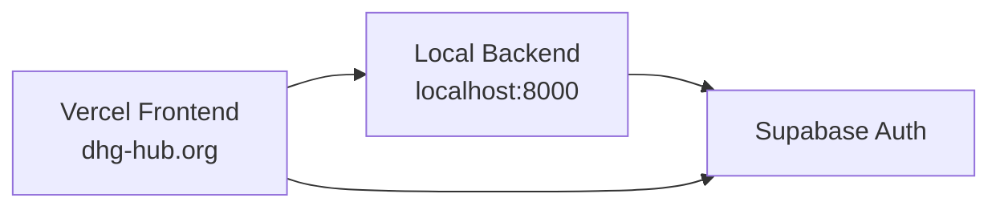
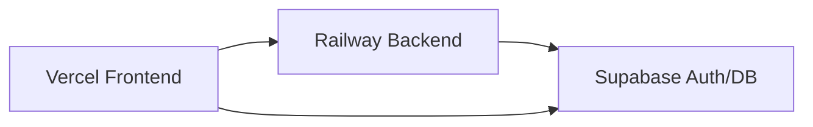

# Backend Deployment Options Guide

This document outlines various backend deployment options for the DHG Hub application, comparing features, costs, and setup complexity.

## Quick Comparison

| Service | Free Tier | Starting Cost | Best For | Setup Complexity |
|---------|-----------|---------------|----------|------------------|
| Railway | $5 credit/mo | ~$5-10/mo | Small-medium apps | Low |
| Heroku | None | $7/mo | Traditional apps | Medium |
| DigitalOcean | None | $5/mo | Scalable apps | Medium |
| AWS Lambda | 1M req/mo | Pay per use | Serverless apps | High |

## Detailed Analysis

### 1. Railway
**Recommended Choice**
- **Pros:**
  - GitHub integration
  - Simple FastAPI deployment
  - Automatic HTTPS/SSL
  - Easy environment variable management
- **Costs:**
  - Free tier: $5 credit monthly
  - Production: Usage-based (~$5-10/mo) [Lower without PostgreSQL]
- **Best For:**
  - FastAPI applications
  - Quick deployments
  - Development teams

### 2. Heroku
**Traditional Choice**
- **Pros:**
  - Mature platform
  - Excellent PostgreSQL integration
  - Good CI/CD support
- **Cons:**
  - No free tier
  - Higher costs for scaling
- **Costs:**
  - Basic Dyno: $7/month
  - Eco Dyno: $5/month
  - PostgreSQL: From $5/month

### 3. DigitalOcean App Platform
**Scalable Choice**
- **Pros:**
  - Reliable infrastructure
  - Built-in monitoring
  - Good scaling options
- **Costs:**
  - Basic: $5/month
  - Pro: $12/month
  - Additional costs for databases
- **Best For:**
  - Long-term projects
  - Teams needing monitoring

### 4. AWS Lambda + API Gateway
**Serverless Choice**
- **Pros:**
  - Pay per use
  - Highly scalable
  - AWS ecosystem
- **Cons:**
  - Complex setup
  - Cold starts
  - Learning curve
- **Costs:**
  - Free tier: 1M requests/month
  - Pay per request after

## Current Architecture

### Local Development Setup


### Production Architecture (Recommended)


## Environment Configuration

### Development
```env
VITE_SUPABASE_URL=your-supabase-url
VITE_SUPABASE_ANON_KEY=your-anon-key
VITE_API_URL=http://localhost:8000
```

### Production
```env
VITE_SUPABASE_URL=your-supabase-url
VITE_SUPABASE_ANON_KEY=your-anon-key
VITE_API_URL=https://your-railway-app.railway.app
```

## Security Considerations

1. **Environment Variables**
   - Never commit .env files
   - Use different keys per environment
   - Rotate credentials regularly

2. **CORS Configuration**
   - Configure allowed origins
   - Use secure headers
   - Enable HTTPS only

3. **Authentication**
   - Use Supabase auth tokens
   - Implement proper session management
   - Secure API endpoints

## Monitoring & Maintenance

1. **Health Checks**
   - Implement /health endpoint
   - Monitor API status
   - Track response times

2. **Logging**
   - Application logs
   - Error tracking
   - Performance metrics

3. **Backups**
   - Database backups
   - Configuration backups
   - Disaster recovery plan 