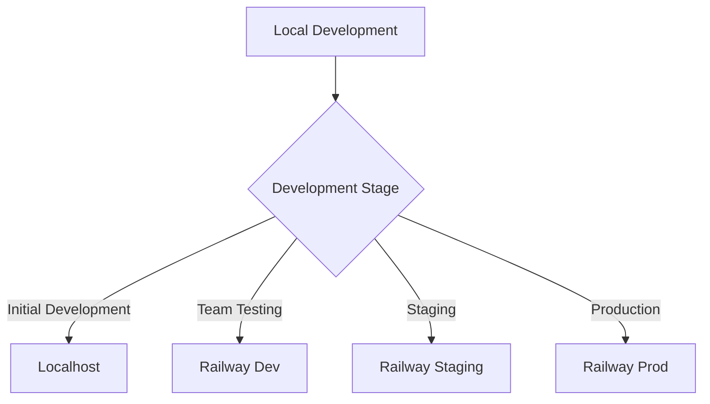

# Railway vs Localhost for Backend Development

## Railway Development Benefits

### Pros
1. **Consistent Environment**
   - Same environment as production
   - No "works on my machine" issues
   - Consistent database state

2. **Team Collaboration**
   - Shared backend endpoint
   - Everyone uses same API URL
   - Real-time updates visible to team

3. **URL Management**
```env
# One consistent URL for all environments
VITE_API_URL=https://dhg-backend-dev.railway.app

# No need to switch between localhost/production
SUPABASE_SITE_URL=https://dhg-backend-dev.railway.app
```

4. **Early Detection**
   - Infrastructure issues caught earlier
   - SSL/HTTPS issues identified sooner
   - Network-related bugs surface earlier

### Cons
1. **Development Speed**
   - Slower feedback loop
   - Network latency
   - Deploy time for changes

2. **Cost**
   - Railway charges for development instance
   - Bandwidth costs
   - Database usage costs

## Localhost Development Benefits

### Pros
1. **Speed**
   - Instant feedback
   - No deploy time
   - No network latency

2. **Cost**
   - Free
   - No bandwidth charges
   - Local database

3. **Offline Work**
   - Can work without internet
   - No dependency on external services
   - Quick iterations

### Cons
1. **Environment Differences**
   - Local setup may differ
   - Missing production issues
   - Extra configuration needed

## Recommended Approach

### Hybrid Development


1. **Initial Development**
   ```bash
   # Use localhost for rapid development
   VITE_API_URL=http://localhost:8000
   ```

2. **Team Testing**
   ```bash
   # Switch to Railway for team testing
   VITE_API_URL=https://dhg-backend-dev.railway.app
   ```

3. **Production Pipeline**
   ```bash
   # Staging and production on Railway
   VITE_API_URL=https://api.dhg-hub.org
   ```

## Best Practices

1. **Local Development**
```bash
# Start backend locally
cd backend
pnpm dev

# Start frontend with local backend
cd apps/dhg-baseline
VITE_API_URL=http://localhost:8000 pnpm dev
```

2. **Railway Development**
```bash
# Use Railway for team testing
cd apps/dhg-baseline
VITE_API_URL=https://dhg-backend-dev.railway.app pnpm dev
```

3. **Environment Switching**
```env
# .env.local
VITE_API_URL=http://localhost:8000

# .env.development
VITE_API_URL=https://dhg-backend-dev.railway.app

# .env.production
VITE_API_URL=https://api.dhg-hub.org
```

## Recommendation

1. **Start with Localhost**
   - Faster development cycle
   - Easy debugging
   - Quick iterations

2. **Move to Railway When**:
   - Team needs shared backend
   - Testing auth flows
   - Preparing for production
   - Debugging environment-specific issues

3. **Consider Railway Earlier If**:
   - Team is distributed
   - Need consistent environment
   - Working on complex auth flows
   - Testing production-like scenarios 