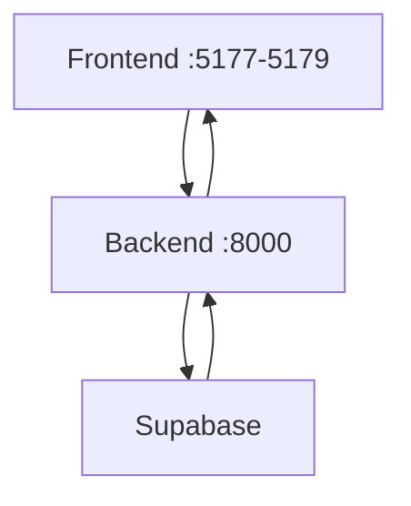

# Supabase Development Configuration

## Local Development Site URL

In Supabase Dashboard > Authentication > URL Configuration:

### Site URL (Development)
```
http://localhost:8000
```

### Redirect URLs (Development)
```
# Backend callback
http://localhost:8000/api/auth/callback

# Frontend apps
http://localhost:5177  # dhg-baseline
http://localhost:5178  # dhg-test
http://localhost:5179  # dhg-lovable
```

## Important Notes

1. **HTTP vs HTTPS**:
   - Use `http://` for local development
   - Supabase accepts non-HTTPS URLs for localhost

2. **Port Numbers**:
   - Backend runs on `:8000`
   - Each frontend app has its own port
   - Must match your vite.config.ts settings

3. **Testing Flow**:


## Switching to Production

When ready to deploy:
1. Change Site URL to `https://api.dhg-hub.org`
2. Add production redirect URLs
3. Keep development URLs for local testing

**Pro Tip**: Create a separate Supabase project for development to avoid changing URLs frequently. 