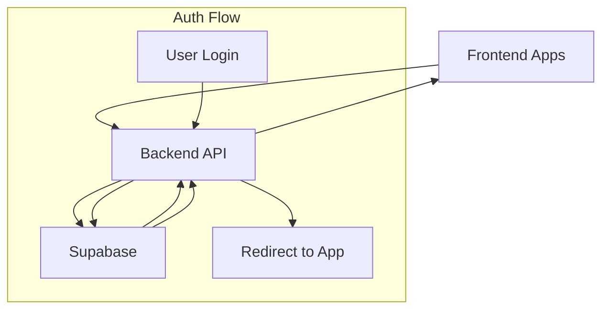

# Supabase URL Configuration Guide

## Site URL Configuration

In Supabase Dashboard > Authentication > URL Configuration:

### Site URL
```
https://api.dhg-hub.org
```
This should point to your backend API, NOT your frontend apps.

### Redirect URLs
```
# Development URLs
http://localhost:8000/api/auth/callback
http://localhost:5177
http://localhost:5178
http://localhost:5179

# Production URLs
https://api.dhg-hub.org/api/auth/callback
https://*.dhg-hub.org
https://*.vercel.app

# Preview Deployments
https://*.vercel.app
```

## Backend Configuration
```python:backend/app/config.py
ALLOWED_REDIRECT_URLS = [
    # Development
    "http://localhost:5177",  # dhg-baseline
    "http://localhost:5178",  # dhg-test
    "http://localhost:5179",  # dhg-lovable
    
    # Production
    "https://*.dhg-hub.org",
    
    # Preview
    "https://*.vercel.app"
]
```

## Key Points

1. **Site URL**: 
   - Points to your backend API
   - Handles all Supabase auth callbacks
   - Single point of auth management

2. **Redirect URLs**:
   - Include your backend callback URL
   - Include all frontend app URLs
   - Include development URLs
   - Include preview deployment URLs

3. **Security**:
   - Backend validates all redirects
   - Prevents unauthorized redirects
   - Centralizes auth flow

## Environment Variables

### Backend (.env)
```env
SUPABASE_URL=your_supabase_url
SUPABASE_ANON_KEY=your_anon_key
SUPABASE_SERVICE_ROLE_KEY=your_service_key
ALLOWED_ORIGINS=http://localhost:5177,http://localhost:5178,http://localhost:5179
```

### Frontend Apps (.env)
```env
# All frontend apps only need API URL
VITE_API_URL=http://localhost:8000
```

## Flow Diagram


## Verification Steps

1. Check Supabase Dashboard:
   - [ ] Site URL points to backend
   - [ ] All redirect URLs listed
   - [ ] No direct frontend URLs in Site URL

2. Test Auth Flow:
   - [ ] Development environment works
   - [ ] Production redirects work
   - [ ] Preview deployments work

3. Security Checks:
   - [ ] Invalid redirects blocked
   - [ ] CORS properly configured
   - [ ] Auth tokens properly handled 