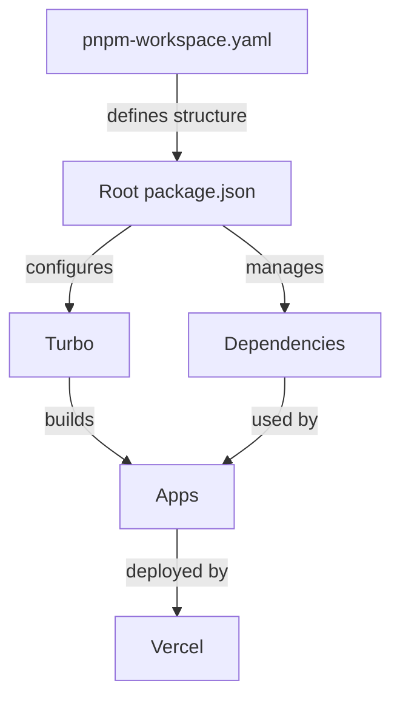

# DHG Monorepo Documentation

## Overview
This monorepo (monolithic repository) contains multiple applications and shared packages managed under a single version control system. Our setup uses pnpm for package management and Turborepo for build system orchestration.

## Project Structure

dhg-monorepo/
├── apps/ # Application directories
│ ├── dhg-baseline/ # Base application for patterns
│ └── dhg-test/ # Test application
├── packages/ # Shared packages (future use)
├── docs/ # Documentation
└── scripts/ # Utility scripts


## Key Components

### 1. Package Manager (pnpm)
- **What**: Fast, disk-efficient package manager
- **Why**: 
  - Uses hard links to save disk space
  - Better monorepo support than npm/yarn
  - Strict dependency management
- **Configuration**: `pnpm-workspace.yaml` defines workspace structure

### 2. Build System (Turborepo)
- **What**: Incremental build system
- **Why**:
  - Caches build outputs
  - Optimizes CI/CD pipelines
  - Manages dependencies between apps
- **Configuration**: `turbo.json` defines build tasks

### 3. Applications
Each app in the `apps/` directory is a standalone application:

#### dhg-baseline
- Purpose: Baseline application establishing patterns
- Tech Stack: Vite + React + TypeScript
- Key Files:
  - `vite.config.ts`: Vite configuration
  - `src/App.tsx`: Main application component
  - `package.json`: App-specific dependencies

#### dhg-test
- Purpose: Testing application for validating configurations
- Tech Stack: Same as baseline
- Structure: Mirrors baseline app

### 4. Environment Strategy
Three environments:
1. **Production** (main branch)
   - Live website
   - Requires PR approvals
   - Deployed to dhg-hub.org

2. **Development** (development branch)
   - Testing environment
   - Deployed to dev.dhg-hub.org
   - Integration testing

3. **Preview** (feature branches)
   - Per-feature testing
   - Automatic deployments
   - Pattern: feature/*.dhg-hub.org

### 5. Key Files Explained

#### Root Directory Files
- `package.json`
  ```json:docs/monorepo-guide.md
  {
    "name": "dhg-monorepo",
    "private": true,
    "packageManager": "pnpm@9.15.3",
    // Scripts for all apps
    "scripts": {
      "dev": "turbo run dev",
      "build": "turbo run build"
    }
  }
  ```
  - Defines workspace-level configuration
  - Specifies package manager version
  - Contains shared scripts

- `turbo.json`
  ```json
  {
    "tasks": {
      "dev": {
        "cache": false,
        "persistent": true
      },
      "build": {
        "outputs": ["dist/**"]
      }
    }
  }
  ```
  - Configures build pipeline
  - Defines task relationships
  - Sets caching behavior

- `vercel.json`
  ```json
  {
    "buildCommand": "pnpm turbo build",
    "installCommand": "pnpm install"
  }
  ```
  - Configures Vercel deployments
  - Sets build commands
  - Manages deployment settings

## Workflow Guide

### Local Development
1. Clone repository
2. Install dependencies:
   ```bash
   pnpm install
   ```
3. Start development servers:
   ```bash
   pnpm dev
   ```

### Making Changes
1. Create feature branch from development:
   ```bash
   git checkout -b feature/your-feature
   ```
2. Make changes
3. Commit and push
4. Create PR to development
5. After testing, create PR to main

## Pros and Cons

### Advantages
1. **Shared Code**
   - Easy code sharing between apps
   - Consistent versioning
   - Single source of truth

2. **Development Efficiency**
   - Single repository to clone
   - Simplified dependency management
   - Coordinated changes across apps

3. **Build Optimization**
   - Cached builds with Turborepo
   - Parallel execution
   - Intelligent dependency tracking

### Challenges
1. **Repository Size**
   - Can grow large
   - Longer initial clone time
   - More complex git history

2. **Learning Curve**
   - More tools to learn
   - Complex configuration
   - Team coordination needed

3. **Build Complexity**
   - More sophisticated CI/CD
   - Careful dependency management
   - Potential for conflicts

## Best Practices
1. Keep shared code in `packages/`
2. Use consistent naming conventions
3. Document changes thoroughly
4. Test across all apps when making shared changes
5. Use feature branches for all changes
6. Regular dependency updates

## Common Tasks

### Adding Dependencies
- Workspace-level:
  ```bash
  pnpm add -w package-name
  ```
- App-specific:
  ```bash
  pnpm --filter app-name add package-name
  ```

### Running Commands
- All apps:
  ```bash
  pnpm dev
  ```
- Specific app:
  ```bash
  pnpm --filter app-name dev
  ```

## Troubleshooting

### Common Issues
1. **Package Not Found**
   - Run `pnpm install`
   - Check package.json
   - Verify pnpm-workspace.yaml

2. **Build Failures**
   - Clear Turborepo cache
   - Check dependency versions
   - Verify build scripts

3. **Deployment Issues**
   - Verify Vercel configuration
   - Check environment variables
   - Review build logs


# DHG Monorepo Documentation

[Previous sections remain the same...]

## Configuration Deep Dive

### Core Configuration Files

#### 1. Root Package Manager (pnpm-workspace.yaml)
- **Purpose**: Defines workspace structure for pnpm
- **Function**: 
  - Tells pnpm which directories contain packages
  - Enables workspace features
  - Manages shared dependencies
- **Concepts**:
  - Workspaces allow multiple packages/apps to share dependencies
  - Hoisting optimizes dependency installation
  - Pattern matching determines which directories are included

#### 2. Root Package Configuration (package.json)
```json
{
  "name": "dhg-monorepo",
  "private": true,
  "packageManager": "pnpm@9.15.3",
  "scripts": {
    "dev": "turbo run dev",
    "build": "turbo run build",
    "lint": "turbo run lint",
    "test": "turbo run test",
    "turbo-ignore": "node -e \"process.exit(require('turbo').shouldOptimize(__dirname))\""
  },
  "devDependencies": {
    "@vercel/node": "^5.0.2",
    "turbo": "latest"
  }
}
```
- **Purpose**: Root-level project configuration
- **Key Components**:
  - `private: true`: Prevents accidental publishing
  - `packageManager`: Enforces pnpm version
  - `scripts`: Defines workspace-wide commands
  - `devDependencies`: Tools needed across all apps
- **Concepts**:
  - Workspace root manages shared tooling
  - Scripts cascade to all packages
  - Version management is centralized

#### 3. Build Pipeline (turbo.json)
```json
{
  "$schema": "https://turbo.build/schema.json",
  "tasks": {
    "dev": {
      "cache": false,
      "persistent": true
    },
    "build": {
      "outputs": ["dist/**"]
    },
    "lint": {},
    "test": {}
  }
}
```
- **Purpose**: Configures build system behavior
- **Key Features**:
  - Task definitions
  - Caching rules
  - Output management
- **Concepts**:
  - Task dependencies
  - Incremental builds
  - Cache invalidation
  - Parallel execution

#### 4. Deployment Configuration (vercel.json)
```json
{
  "$schema": "https://openapi.vercel.sh/vercel.json",
  "version": 2,
  "buildCommand": "pnpm turbo build",
  "installCommand": "pnpm install",
  "framework": null
}
```
- **Purpose**: Configures Vercel deployment
- **Functions**:
  - Defines build process
  - Sets installation steps
  - Configures framework settings
- **Concepts**:
  - Build optimization
  - Deployment pipelines
  - Environment configuration

### Application-Level Configuration

#### 1. App Package Configuration (apps/[app-name]/package.json)
```json
{
  "name": "dhg-baseline",
  "private": true,
  "version": "0.0.0",
  "type": "module",
  "scripts": {
    "dev": "vite",
    "build": "tsc -b && vite build",
    "lint": "eslint .",
    "preview": "vite preview"
  },
  "dependencies": {
    "react": "^18.3.1",
    "react-dom": "^18.3.1"
  },
  "devDependencies": {
    "@types/react": "^18.3.18",
    "@types/react-dom": "^18.3.5",
    "@vitejs/plugin-react": "^4.3.4",
    "typescript": "~5.6.2",
    "vite": "^6.0.5"
  }
}
```
- **Purpose**: App-specific configuration
- **Key Components**:
  - Local scripts
  - Direct dependencies
  - Development tools
- **Concepts**:
  - Package isolation
  - Version management
  - Build tooling

#### 2. Vite Configuration (apps/[app-name]/vite.config.ts)
```typescript
import { defineConfig } from 'vite'
import react from '@vitejs/plugin-react'

export default defineConfig({
  plugins: [react()],
})
```
- **Purpose**: Configures build tool
- **Functions**:
  - Plugin setup
  - Build optimization
  - Development server
- **Concepts**:
  - Module bundling
  - Hot Module Replacement
  - Code splitting

### Configuration Relationships



### Key Concepts Explained

#### 1. Workspace Management
- **What**: Organizing multiple packages in one repo
- **Why**: 
  - Share code efficiently
  - Maintain consistency
  - Simplify dependency management
- **How**: 
  - pnpm workspaces
  - Shared configurations
  - Centralized scripts

#### 2. Build Pipeline
- **What**: Automated build process
- **Why**:
  - Consistent builds
  - Optimized performance
  - Parallel execution
- **How**:
  - Turborepo
  - Task definitions
  - Cache management

#### 3. Dependency Management
- **What**: Managing package dependencies
- **Why**:
  - Version consistency
  - Disk efficiency
  - Clear dependency graph
- **How**:
  - pnpm
  - Workspace hoisting
  - Lock files

#### 4. Development Environment
- **What**: Local development setup
- **Why**:
  - Fast feedback
  - Consistent experience
  - Easy testing
- **How**:
  - Vite
  - Hot Module Replacement
  - TypeScript integration

### Best Practices

1. **Version Management**
   - Use exact versions for shared dependencies
   - Lock files should be committed
   - Regular dependency updates

2. **Script Naming**
   - Consistent across packages
   - Clear purpose
   - Documentation for complex scripts

3. **Configuration Updates**
   - Document changes
   - Test across all apps
   - Consider backward compatibility

4. **Dependency Management**
   - Minimize duplicate dependencies
   - Regular audits
   - Clear dependency boundaries

### Common Configuration Tasks

1. **Adding a New App**
   ```bash
   # Create app directory
   mkdir apps/new-app
   cd apps/new-app
   
   # Initialize with Vite
   pnpm create vite . --template react-ts
   
   # Update workspace
   pnpm install
   ```

2. **Adding Shared Dependencies**
   ```bash
   # Add to root
   pnpm add -w package-name
   
   # Add to specific app
   pnpm --filter app-name add package-name
   ```

3. **Updating Configurations**
   ```bash
   # Update build pipeline
   vim turbo.json
   
   # Update deployment
   vim vercel.json
   ```

### Troubleshooting Configuration

1. **Dependency Issues**
   - Check pnpm-lock.yaml
   - Verify workspace patterns
   - Review hoisting effectiveness

2. **Build Problems**
   - Examine Turbo cache
   - Check task dependencies
   - Verify output paths

3. **Deployment Failures**
   - Review Vercel logs
   - Check build commands
   - Verify environment variables